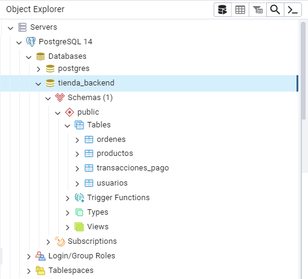
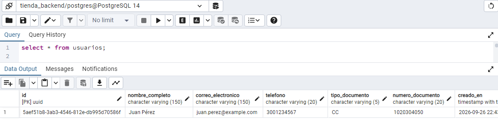
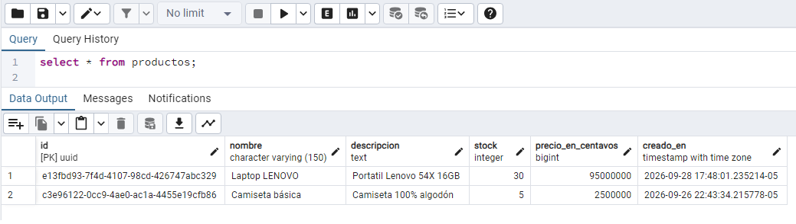
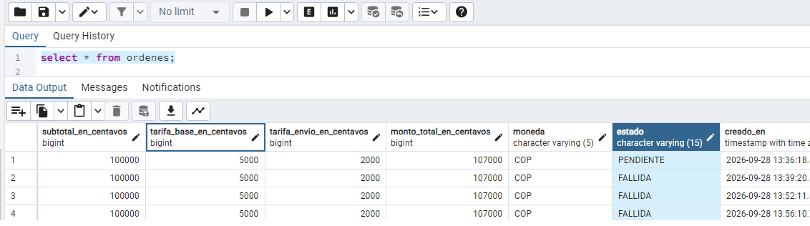
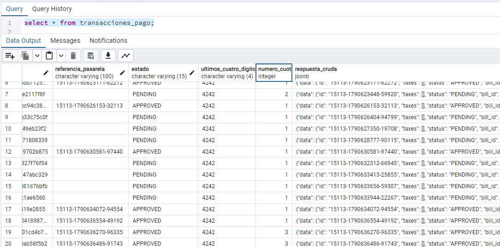

# BASE DE DATOS · tienda_backend

A continuación se encuentran los pasos a seguir para la creación de la base de datos PostgreSQL seleccionada.

## Scripts para creación de base de datos

BASE DE DATOS: tienda_backend

Creación y uso de la base de datos en MySQL.

```

-- Crea la base de datos si no existe
DROP DATABASE IF EXISTS tienda_backend;

CREATE DATABASE tienda_backend
    WITH
    OWNER = postgres
    ENCODING = 'UTF8'
    LC_COLLATE = 'Spanish_Colombia.1252'
    LC_CTYPE = 'Spanish_Colombia.1252'
    TABLESPACE = pg_default
    CONNECTION LIMIT = -1
    IS_TEMPLATE = False;

```

Se observa la estructura de tablas de la base.




Se requiere el siguiente comando para la base:

```

CREATE EXTENSION IF NOT EXISTS "pgcrypto"; -- para gen_random_uuid()

```
---

- BASE DE DATOS BÁSICA -DEMO: Se esta probando solo al funcionalidad del pago con tarjeta de manera genaral, se requieren 4 tabals básicas.

* Tabla usuarios: Para guardar los usaurios para las tarjetas de crédito.
* Tabla productos: Tabla requerida para seleccionar un artículo y gestionar su compra y pago según las características requeridas.
* Tabla ordenes: En esta tabla se registran "todas" las operaciones que se realizan de manera exitosa o fallida.
* Tabla transacciones_pago: Aquí se guardan "todas" las transacciones realizadas teniendo en cuenta el no registro de datos sensibles.

---

A continuación se visualizan los scripts para la creación de las tablas necesarias para el proyecto.

# TABLA: usuarios

```

CREATE TABLE IF NOT EXISTS usuarios (
    id                  UUID PRIMARY KEY DEFAULT gen_random_uuid(),
    nombre_completo     VARCHAR(150)     NOT NULL,
    correo_electronico  VARCHAR(150)     NOT NULL UNIQUE,
    telefono            VARCHAR(20)      NOT NULL,
    tipo_documento      VARCHAR(5)       NOT NULL,
    numero_documento    VARCHAR(20)      NOT NULL,
    creado_en           TIMESTAMPTZ      NOT NULL DEFAULT now()
);

```



Se puede observar el estandar UUID para IDs, al igual que las fechas y tiempos de creación de cada registro.

## Script para ingresar usuarios de prueba.
```

INSERT INTO usuarios (id, nombre_completo, correo_electronico, telefono, tipo_documento, numero_documento)
VALUES ('5aef51b8-3ab3-4546-812e-db995d70586f', 'Juan Pérez', 'juan.perez@example.com', '3001234567', 'CC', '1020304050')
ON CONFLICT (id) DO NOTHING;


```
***


# TABLA: productos

```

CREATE TABLE IF NOT EXISTS productos (
    id                   UUID PRIMARY KEY DEFAULT gen_random_uuid(),
    nombre               VARCHAR(150)    NOT NULL,
    descripcion          TEXT,
    stock                INTEGER         NOT NULL CHECK (stock >= 0),
    precio_en_centavos   BIGINT          NOT NULL CHECK (precio_en_centavos > 0),
    creado_en            TIMESTAMPTZ     NOT NULL DEFAULT now()
);


```




En esta imagen se puede observar los productos registrado se deben ingresar los datos con anterioridad y de manera manual.


## Script para ingresar productos.
```

INSERT INTO productos (id, nombre, descripcion, stock, precio_en_centavos)
VALUES ('c3e96122-0cc9-4ae0-ac1a-4455e19cfb86', 'Camiseta básica', 'Camiseta 100% algodón', 50, 5000000)
ON CONFLICT (id) DO NOTHING;

INSERT INTO productos (id, nombre, descripcion, stock, precio_en_centavos)
VALUES ('e13fbd93-7f4d-4107-98cd-426747abc329', 'Laptop LENOVO', 'Portatil Lenovo 54X 16GB', 30, 95000000)
ON CONFLICT (id) DO NOTHING;

```

***


# TABLA: ordenes 

```

CREATE TABLE IF NOT EXISTS ordenes (
    id                          UUID PRIMARY KEY,
    usuario_id                  UUID         NOT NULL REFERENCES usuarios(id),
    producto_id                 UUID         NOT NULL REFERENCES productos(id),
    cantidad                    INTEGER      NOT NULL CHECK (cantidad > 0),
    subtotal_en_centavos        BIGINT       NOT NULL DEFAULT 0,
    tarifa_base_en_centavos     BIGINT       NOT NULL DEFAULT 0,
    tarifa_envio_en_centavos    BIGINT       NOT NULL DEFAULT 0,
    monto_total_en_centavos     BIGINT       NOT NULL CHECK (monto_total_en_centavos > 0),
    moneda                      VARCHAR(5)   NOT NULL,
    estado                      VARCHAR(15)  NOT NULL DEFAULT 'PENDIENTE',
    creado_en                   TIMESTAMPTZ  NOT NULL DEFAULT now(),
    actualizado_en              TIMESTAMPTZ  NOT NULL DEFAULT now()
);

```




# TABLA: transacciones_pago

```

CREATE TABLE IF NOT EXISTS transacciones_pago (
    id                        UUID PRIMARY KEY,
    orden_id                   UUID        NOT NULL REFERENCES ordenes(id),
    referencia_pasarela        VARCHAR(100) NOT NULL,
    estado                      VARCHAR(15) NOT NULL,
    ultimos_cuatro_digitos     VARCHAR(4)  NOT NULL,
    numero_cuotas               INTEGER    NOT NULL,
    respuesta_cruda             JSONB,
    creado_en                   TIMESTAMPTZ NOT NULL DEFAULT now()
);

```



---

# INDICES: 
Creación de indices para un mejor desempeño de consultas.

```

CREATE INDEX IF NOT EXISTS idx_ordenes_usuario_id ON ordenes(usuario_id);
CREATE INDEX IF NOT EXISTS idx_transacciones_orden_id ON transacciones_pago(orden_id);


```


